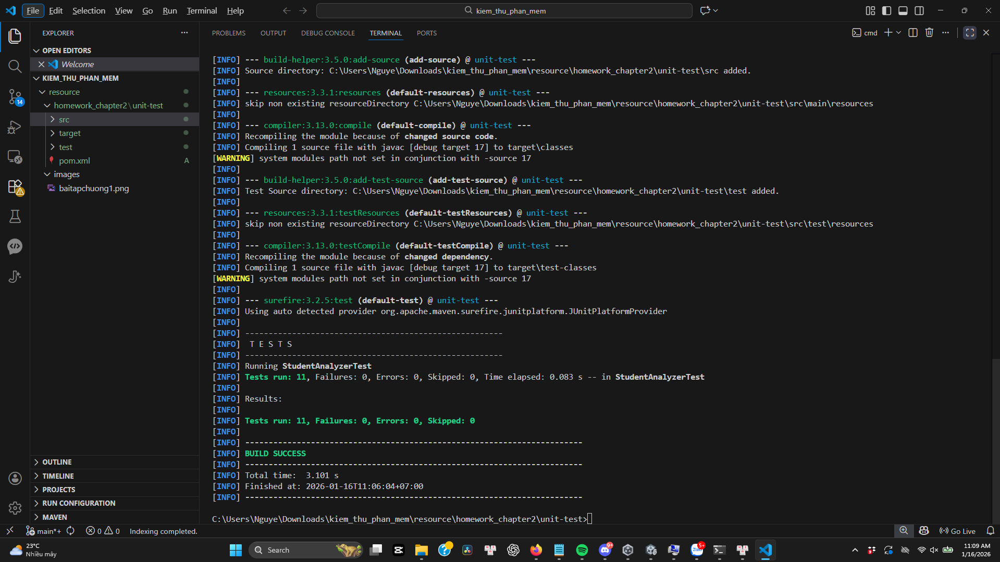

## Thông tin sinh viên
* **Họ và tên:** Nguyễn Đức Huy
* **Mã sinh viên:** BIT220079

## Kết quả thực hành (Tuần 1 & 2)

### 1. Trải nghiệm giao diện với Can't Unsee (Tuần 1)
# 

### 2. Bài tập Chapter 2 (Cấu hình & Unit Test)
# 

### 3. Bài tập Chapter 3 
# 
# 
---
### 4. Bài Tập Chương 4
# 
# 
# 
# 

## Student Analyzer (Phân tích điểm số)

### 1. Mô tả bài toán
Xây dựng thư viện Java để xử lý danh sách điểm số của học sinh với các chức năng:
* **`countExcellentStudents`**: Đếm số học sinh giỏi (Điểm >= 8.0). Bỏ qua các điểm không hợp lệ (< 0 hoặc > 10).
* **`calculateValidAverage`**: Tính điểm trung bình của các điểm hợp lệ trong danh sách.

### 2. Yêu cầu hệ thống
* Java JDK: 17+
* Maven: 3.x
* IDE: VS Code

### 3. Hướng dẫn cài đặt và chạy kiểm thử
Để chạy bộ kiểm thử đơn vị (Unit Tests) và xem kết quả, sử dụng lệnh sau trong terminal:
bash: mvn clean test

### Chapter 3: Cypress Exercise

Goal: Write E2E tests for the Cypress exercise.

Stack: Cypress 13, Node 18+, npm.

How to run:

    Install deps: npm install
    Open runner: npx cypress open
    Run headless: npx cypress run

# JMeter Performance Test Report
## Muc tieu
- Hieu cach su dung JMeter de kiem thu hieu nang.
- Thiet ke kich ban kiem thu voi tham so khac nhau.
- Phan tich ket qua va viet bao cao.

## Website duoc kiem thu
- URL: https://en.wikipedia.org

## Moi truong
- JMeter version: 5.6.3
- OS: Windows

## Cau hinh va kich ban
HTTP Request Defaults
Protocol: https
Server Name: en.wikipedia.org
HTTP Header Manager
User-Agent: Custom (tránh lỗi HTTP 403)
Listeners
Summary Report
View Results Tree

### Thread Group 1 (Basic)
Number of Threads: 10
Loop Count: 5
Request:
GET /

### Thread Group 2 (Heavy)
Number of Threads: 50
Ramp-up Period: 30 giây
Requests:
GET /
GET /wiki/Main_Page

### Thread Group 3 (Custom)
Number of Threads: 20
Duration: 60 giây (Scheduler)
Requests:
GET /wiki/1
GET /wiki/2

### Ket qua (trich tu Summary Report)
| Label       | Avg Response Time (ms) | Throughput (req/sec) | Error %  |
| ----------- | ---------------------- | -------------------- | -------- |
| GET_Home    | 2607                   | 1.41                 | 0.00     |
| GET_Subpage | 1817                   | 1.47                 | 0.00     |
| GET_1       | 4788                   | 2.27                 | 0.00     |
| GET_2       | 2877                   | 2.28                 | 0.00     |
| **TOTAL**   | **2657**               | **1.79**             | **0.00** |

- File ket qua: `results/summary.csv`

